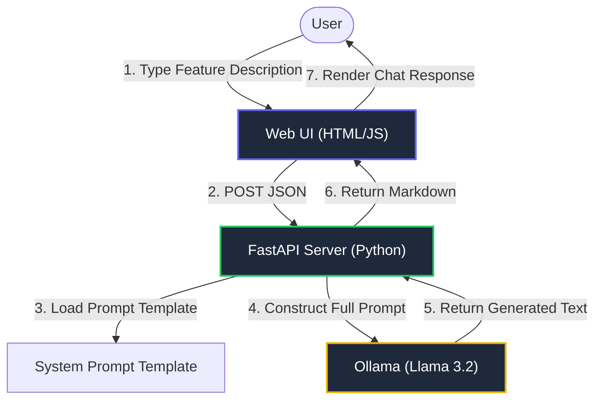

# ✨ Test Genie: Local LLM Test Case Generator

A local, privacy-focused tool that uses **Ollama** and **Deep Learning** to generate comprehensive test cases for your software features. Built with a modern **FastAPI** backend and a premium **Dark Mode UI**.


## 🏗️ Architecture

The system follows a 3-tier architecture designed for privacy and local execution.



## 🚀 Getting Started

### Prerequisites
1.  **Python 3.8+**
2.  **Ollama** installed and running locally.
3.  **Llama 3.2 Model** pulled:
    ```bash
    ollama pull llama3.2:3b
    ```

### Installation

1.  Clone the repository:
    ```bash
    git clone https://github.com/rahultalwar/LocalTestCaseGenerator.git
    cd LocalTestCaseGenerator
    ```

2.  Run the setup & launch script:
    ```bash
    ./run.sh
    ```
    *(This script automatically creates a venv, installs dependencies, checks your Ollama connection, and starts the server.)*

3.  Open the App:
    - Go to `http://localhost:8000` in your browser.

## 🛠️ Usage

1.  **Enter a Prompt**: Type a feature description, e.g., *"A login page with OAuth support and 'Forgot Password' flow"*
2.  **Generate**: Click the send button.
3.  **Review**: The AI will generate a structured test plan including:
    - Test Case IDs
    - Pre-conditions
    - Steps
    - Expected Results

## ⚙️ Customization

To change the behavior of the AI, edit the `TEST_CASE_TEMPLATE` variable in `tools/server.py`.

```python
TEST_CASE_TEMPLATE = """
You are an expert QA Automation Engineer...
"""
```

## 📄 License
MIT
